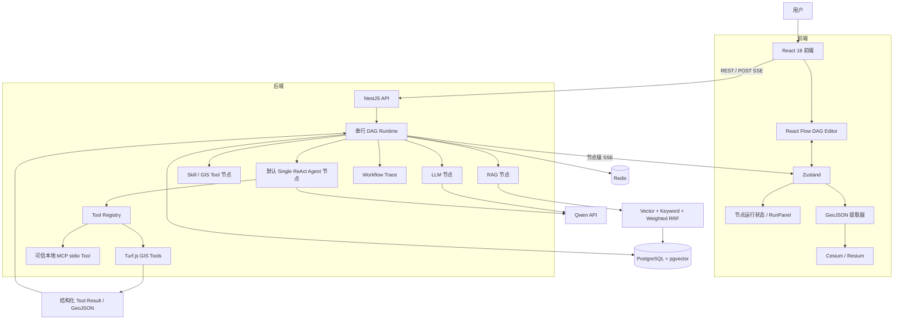

# FlowAI Studio —— 面向空间分析的可视化 AI 工作流平台

FlowAI Studio 是一个面向空间分析场景的全栈 AI 工作流项目。用户可以在 React Flow 画布上组合输入、LLM、RAG、工具、条件、Agent 与输出节点，由 NestJS 串行 DAG Runtime 执行流程；默认 Single ReAct Tool Agent 负责理解任务和选择已授权工具，确定性的空间计算交给 Turf.js，结构化 GeoJSON 结果最终在 Cesium 中展示。

维护者：[GitHub ZC-peng](https://github.com/ZC-peng)

## 项目定位

这个项目重点解决两个问题：

1. 将 LLM、知识检索和确定性工具组织成可保存、可运行、可观察的工作流，而不是把所有逻辑塞进一次模型调用。
2. 在空间分析场景中，让模型负责理解意图和生成工具参数，让 Turf.js 负责距离、缓冲区和点落区等计算，避免让模型直接估算地理结果。

当前架构可以概括为：

```text
React Flow 可视化串行 DAG
        +
NestJS Workflow Runtime
        +
Single ReAct Tool Agent（默认）
        +
Hybrid RAG / Turf.js GIS Tool
        +
GeoJSON / Cesium / Trace
```

## 核心能力

### React Flow + Zustand 可视化编排

- 基于 React Flow 构建受控 DAG 画布，支持开始、用户输入、LLM、RAG、Skill、条件、Agent 和输出节点。
- 通过 Zustand 保存节点、边、选中节点与执行状态，编辑器核心组件使用 selector、`useShallow` 和节点级订阅控制更新范围。
- 支持节点拖拽、连线、配置、工作流保存、执行状态展示，以及工作流/地图双视图切换。

### 串行 DAG Runtime + 节点级 SSE

- NestJS Runtime 负责图结构校验、环检测、依赖调度、条件分支汇合、节点重试、超时、失败策略与取消。
- 工作流通过 POST SSE 返回执行过程事件，前端消费 `workflow_start`、`node_status`、`done` 和 `error` 等事件，并按节点更新运行状态。
- 前端使用服务端 `executionId` 请求取消任务，同时使用 `AbortController` 关闭浏览器侧事件流。

> 工作流 SSE 当前是节点和执行阶段事件流，不是 LLM token-by-token 输出。

### Single ReAct Tool Agent 与实验性 Supervisor

- Agent 运行在 DAG 的 Agent 节点内部，不负责调度整个工作流。
- 基于模型原生 Function Calling 完成“模型决策 → 工具调用 → Observation → 下一轮决策或最终回答”。
- Tool Registry 统一处理工具授权、Schema、运行时参数校验、超时与错误回传。
- 默认演示和当前主线是受控 Single ReAct；代码另有 Supervisor 将 Worker 暴露为委派工具的实验分支。
- Supervisor 分支尚未完成真实模型集成/E2E 验收，Worker 的 Tool/RAG 统计聚合也不完整，因此不把它描述为成熟多 Agent 平台。

### MCP 工具接入

- 前端可以读取已连接 MCP Server 的工具列表，并把选中的工具 ID 保存到 Agent 节点授权列表。
- Agent Runtime 按当前用户解析 `mcp:<serverId>:<toolName>`，统一生成 Tool Schema、校验参数、设置 15 秒超时并回传错误 Observation。
- 当前只支持可信本地进程的 stdio transport；没有实现远程 SSE transport、进程沙箱或生产级权限审批。

### Hybrid RAG 与结构化引用

- 文档经过解析、切分和 Embedding 后写入 PostgreSQL/pgvector。
- 支持向量检索、关键词检索和加权 RRF 融合的 Hybrid Retrieval。
- 检索结果保留文档、分块、来源和分数，Agent 通过 `[S1]` 等编号生成可校验引用。
- 默认中文关键词检索在没有中文分词扩展时使用参数化片段匹配兜底，不将其描述为生产级中文 BM25。

### Turf.js → GeoJSON → Cesium

- 内置 GIS 工具覆盖缓冲区、点落区筛选和候选点距离排序。
- Agent 只生成和校验工具参数，实际空间计算由 Turf.js 执行。
- 结构化 `toolResults` 随节点结果进入前端状态，再归一化为 GeoJSON FeatureCollection。
- Cesium/Resium 地图组件按需加载，并使用 GeoJsonDataSource 展示结果。

### Trace 与确定性评测

- 工作流执行记录节点状态、耗时、错误和执行结果。
- Single ReAct Agent 节点记录迭代次数、Tool/RAG 调用次数、Token 用量和裁剪后的步骤摘要；实验性 Supervisor 当前只完整聚合 Token。
- 固定评测用例可检查任务完成、工具选择、工具执行、输出关键词、引用有效性、时延与 Token。
- 现有真实模型结果属于冒烟验证，不代表整体准确率或线上稳定性。

## 架构



### GIS Agent 请求链路

```text
用户运行 GIS 工作流
→ DAG Runtime 调度 Agent 节点
→ Qwen 返回 Function Calling
→ Tool Registry 校验工具名和参数
→ Turf.js 执行确定性空间计算
→ Tool Result 作为 Observation 返回 Agent
→ 节点结果通过 SSE 写入 Zustand
→ 前端提取 GeoJSON
→ Cesium 展示空间结果
```

## 当前边界

| 能力 | 当前状态 |
| --- | --- |
| LangGraph | 当前未引入；Agent Runtime 为项目内实现的受控 ReAct 循环 |
| Agent 模式 | 默认是 DAG 内部的 Single ReAct；Supervisor→Worker 为未完成真实集成验收的实验分支，Swarm 未实现 |
| MCP | 已接入 Agent 授权工具链；当前仅支持可信本地 stdio，不支持远程 SSE transport |
| Workflow Streaming | 当前流式发送节点/执行事件，不是 LLM Token Streaming |
| Memory | 类型和配置 UI 中存在开关，执行器尚未读取跨请求历史记忆 |
| Plan-and-Execute | 当前只有策略配置，执行仍进入同一个 Agent 循环 |
| Reflection | 当前只有策略配置，没有独立 Critic / Revision 执行链路 |
| 任务恢复 | 尚未实现服务重启后的持久化队列与断点恢复 |
| HTTP Tool 安全 | 自定义/内置 HTTP 调用尚未补齐生产级 SSRF 防护；仅限受信任的本地演示配置 |
| 生产部署 | 当前 Compose 面向本地演示和开发，不作为生产环境方案 |

## 技术栈

### 前端

- React 18、TypeScript、Vite
- React Flow、Zustand
- Ant Design、React Markdown
- fetch ReadableStream、eventsource-parser
- Cesium、Resium

### 后端与数据

- NestJS、Prisma、Zod
- PostgreSQL、pgvector
- Redis
- Qwen Chat / Embedding API
- Turf.js
- MCP TypeScript SDK

### 工程化

- Docker、Docker Compose、Nginx
- Jest、Vitest
- ESLint、TypeScript Build

## 快速启动

### 环境要求

- Docker Desktop 或兼容的 Docker Engine / Compose
- 若使用本地 Node.js 开发：Node.js 20、npm
- 可用的 Qwen API Key；模型密钥只配置在后端环境中

### 1. 配置环境变量

在项目根目录复制环境变量模板：

```bash
cp .env.example .env
```

Windows PowerShell：

```powershell
Copy-Item .env.example .env
```

至少替换以下占位值：

```dotenv
POSTGRES_PASSWORD=replace-with-a-local-database-password
JWT_SECRET=replace-with-a-long-random-secret
QWEN_API_KEY=replace-with-your-qwen-api-key
QWEN_EMBEDDING_API_KEY=replace-with-your-qwen-embedding-api-key
ALLOW_DEMO_SEED=false
SEED_ADMIN_USERNAME=admin
SEED_ADMIN_PASSWORD=replace-with-at-least-12-characters
```

不要提交 `.env` 或任何真实密钥。

### 2. 启动完整服务

```bash
docker compose up --build
```

Compose 会依次启动 PostgreSQL/pgvector、Redis、数据库迁移、可选的演示数据 Seed、NestJS 后端和 Nginx 前端。默认不会写入演示数据。

启动后访问：

- 前端：`http://localhost`
- 后端健康检查：`http://localhost:3000/api/health`

如需体验内置 GIS Agent 演示，请仅在本地把 `.env` 中的以下配置改为：

```dotenv
ALLOW_DEMO_SEED=true
SEED_ADMIN_USERNAME=admin
SEED_ADMIN_PASSWORD=请设置至少12位的本地演示密码
```

随后重新执行 `docker compose up --build`。登录时使用你设置的用户名和密码；演示 Seed 在生产环境会被拒绝执行。

### 3. 停止服务

```bash
docker compose down
```

## 可复现 Demo

### GIS Agent 候选点距离排序

1. 使用本地演示账号登录。
2. 打开“城市公共服务设施选址 Agent”。
3. 选择工作流“GIS Agent 候选点距离排序”。
4. 运行工作流，观察 Agent 节点执行状态。
5. 执行完成后切换到地图视图，查看结构化 GeoJSON 结果。

演示数据与工作流定义位于：

- `flowai-studio-backend/prisma/seed.ts`
- `evaluation/fixtures/gis-site-selection-demo.md`

### RAG 检索与引用

1. 创建或打开知识库。Seed 中的说明文档使用零向量占位，不用于证明语义检索效果。
2. 上传自己的文本、Markdown、PDF 或 DOCX 文档，并等待解析与向量化完成。
3. 在调试页选择对应知识库发起问题。
4. 检查回答中的 `[S1]` 引用及引用文档/分块信息。

## 测试与构建

后端：

```bash
cd flowai-studio-backend
npm ci
npm test
npm run build
```

前端：

```bash
cd flowai-studio-frontend
npm ci
npm test
npm run lint
npm run build
```

React Flow 的本地轻量节点基准页位于：

```text
/benchmarks/workflow
```

基准页用于在当前设备和开发环境中自行采集节点数量、交互帧率与渲染耗时。仓库不附带宣传性结论；请以实际测量结果为准，不能外推为复杂节点、所有设备或线上性能。

## 目录结构

```text
.
├── flowai-studio-frontend/
│   ├── src/components/       # 工作流节点、配置/运行面板、地图组件
│   ├── src/pages/            # 应用、知识库、调试、Trace 等页面
│   ├── src/store/            # Zustand Store 与业务切片
│   ├── src/router/           # 路由和前端鉴权守卫
│   └── src/utils/            # API、GeoJSON 等工具
├── flowai-studio-backend/
│   ├── src/modules/workflow/ # DAG Runtime、SSE、取消、Trace
│   ├── src/modules/agent/    # ReAct、模型 Provider、Tool Registry、Evaluation
│   ├── src/modules/rag/      # Embedding、检索策略、RRF、引用
│   ├── src/modules/skill/    # 内置/自定义工具与 Turf.js GIS 工具
│   ├── src/modules/mcp/      # MCP Server 管理与客户端
│   └── prisma/               # PostgreSQL Schema、Migration、Seed
├── evaluation/fixtures/      # 可复现评测与演示知识
├── scripts/                  # pgvector 初始化脚本
└── docker-compose.yml        # 本地完整环境
```

## 路线图

- 将 Agent Memory 从配置项补全为按用户、应用、会话隔离的读写链路，并增加 Token 预算、TTL 与删除策略。
- 在有明确复杂任务收益时实现真正的 Plan → Execute 状态机，而不是复用当前 ReAct 循环。
- 为 Reflection 增加独立 Draft、Critic、Revision 和停止条件，并通过评测判断额外时延与 Token 是否值得。
- 为工作流增加真正的模型文本增量事件、前端批量渲染、重连与最终结果校正。
- 增加持久化任务队列、幂等事件和进程重启后的执行恢复。
- 扩充 Agent/RAG 评测集，并将可重复测试和构建检查接入持续集成。
